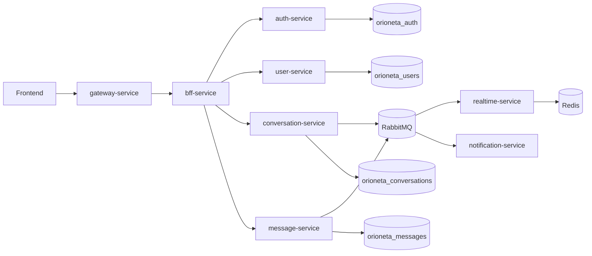

# Arquitectura

Orioneta se organiza como un backend multi-modulo Maven. El `pom.xml` raiz tiene `packaging` tipo `pom` y declara cada microservicio como modulo.

## Flujo principal

## Capas por microservicio

- `domain`: negocio puro y puertos, sin depender de controladores ni persistencia.
- `application`: casos de uso que coordinan comandos, consultas, DTOs y mappers.
- `infrastructure`: adaptadores de entrada/salida como REST, JPA, RabbitMQ, clientes HTTP y configuracion.

## Modulos compartidos

- `shared-kernel`: excepciones, respuestas API y utilidades comunes.
- `shared-events`: contratos de eventos entre servicios.
- `shared-security`: objetos comunes de autenticacion y roles.
